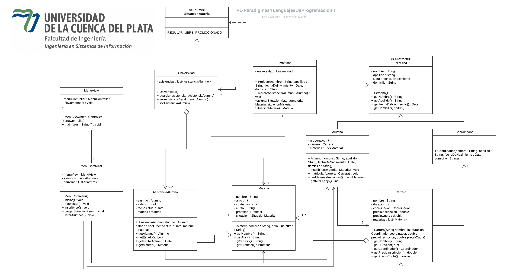

# TP Nro 1 Paradigmas y Lenguajes de Programación

* Asignatura: Paradigma y Lenguajes de Programación II
* Carrera: Ingeniería en Sistemas de Información
* Profesor: Lic. Gabriel D. Del Rosario

## Descripción

El propósito de este proyecto es la de ver las distintas relaciones que puede tener un objeto y como se escribe su estructura en el código.

## Estructura en UML (Diagrama de Clases)

## Lenguaje

* Java - JDK 17

## Autores

* Luciana Rojas
* José Fernando Usui